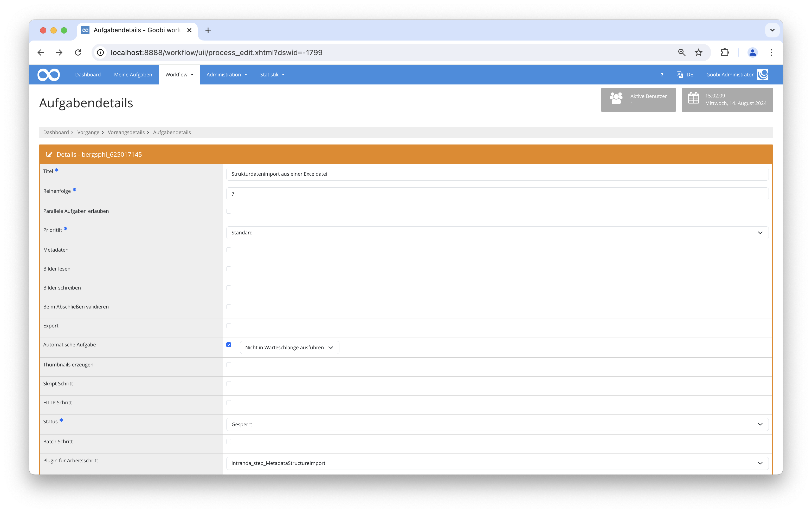

## Einführung
Die vorliegende Dokumentation beschreibt die Installation, Konfiguration und den Einsatz des Plugins zum Import von Strukturdaten aus einer Exceldatei.


## Installation
Um den Strukturdatenimport nutzen zu können, müssen folgende Dateien installiert werden:

```bash
/opt/digiverso/goobi/plugins/step/plugin_intranda_step_MetadataStructureImport-base.jar
/opt/digiverso/goobi/plugins/config/plugin_intranda_step_MetadataStructureImport.xml
```

Im Workflow muss ein neuer Arbeitsschritt eingefügt werden. Dieser Schritt sollte nach dem Import der Bilder und der Erstellung von Derivaten laufen. Es handelt sich hierbei um einen automatischen Arbeitsschritt, bei dem das Plugin `intranda_step_MetadataStructureImport` ausgewählt werden muss.


## Überblick und Funktionsweise
Nach der erfolgreichen Installation, wird das Plugin wie im folgenden Screenshot innerhalb des Workflows integriert.



Wenn das Plugin ausgeführt wird, sucht es zuerst am konfigurierten Ort nach einer Exceldatei. Die Exceldatei kann dabei einen beliebigen Namen haben, muss jedoch die Endung `xlsx` aufweisen.

Wenn eine Exceldatei existiert, wird im Anschluß die METS-Datei des Vorgangs geöffnet. Sofern noch keine Paginierung vorhanden ist, wird diese automatisch erstellt. Falls die Datei Strukturdaten enthält, werden diese nun entfernt. Dadurch ist es möglich, das Plugin auch mehrfach mit aktualisierten Exceldateien aufzurufen.

Nachdem die Vorbereitungen abgeschlossen sind, wird nun die Exceldatei zeilenweise abgearbeitet. Als erstes wird geprüft, welche Hierarchiestufe in der Zeile eingetragen ist. Dabei gibt es vier Optionen: 

- Bei `0` wird die Zeile übersprungen, da es sich dabei um die Informationen zum Publikationstyp selbt handelt. Diese Daten wurden bereits durch den regulären Import erstellt und sind daher hier nicht von Belang.
- Ist die Hierarchienummer der aktuellen Zeile `genauso groß`, wie die der vorherigen Zeile, handelt es sich um ein Geschwisterelement des letzten Elements. Es wird dann als letztes Kindelement des Elternelements des vorherigen Elements erstellt.
- Ist die Hierarchienummer `größer` als die der vorherigen Zeile, handelt es sich um ein Kindelement des vorheringe Elements. Es wird dann eine Hierarchiestufe unterhalb des letzten Elements erstellt.
- Ist die Hierarchienummer `kleiner` als die des vorherigen Elements, wird das vorherige Element so lange nach Elternelementen durchsucht, bis eines mit gleicher Nummer gefunden wird. Das neue Element wird dann als Geschwisterelement des gefundenen Elternelements erstellt.

Der Typ des neuen Elements wird anhand des Mappings zwischen dem konfigurierten Strukturelement in der Exceldatei und dem Regelsatz-Namen ermittelt.

Sofern die Identifier-Spalte einen Wert enthält, erfolgt nun eine OPAC-Abfrage. Alle auf diese Weise gefundenen Metadaten werden dem neuen Strukturelement hinzugefügt, sofern der Regelsatz dies erlaubt.

Anschließend werden dem neuen Strukturelement alle Seiten zugewiesen, die zwischen der Startseite und der letzten Seite der Excelzeile liegen.

Als letztes werden die zusätzlich konfigurierten Metadaten übernommen. Dabei werden vorhandene Metadaten mit den Werten der Exceldatei überschrieben, falls sie bereits durch eine OPAC Anfrage importiert wurden.

## Konfiguration
Die Konfiguration erfolgt in der Datei `plugin_intranda_step_MetadataStructureImport.xml`:

```xml
<config_plugin>
    <!--
        order of configuration is:
          1.) project name and step name matches
          2.) step name matches and project is *
          3.) project name matches and step name is *
          4.) project name and step name are *
	-->

    <config>
        <!-- which projects to use for (can be more then one, otherwise use *) -->
        <project>*</project>
        <step>*</step>

```

Der Bereich `<config>` ist beliebig oft wiederholbar und erlaubt dadurch unterschiedliche Metadatenkonfigurationen für verschiedene Projekte.

Die Unterelemente `<project>` und `<step>` werden zur Prüfung genutzt, ob der vorliegende Block für den aktuellen Schritt genutzt werden soll. Dabei wird zuerst geprüft, ob es einen Eintrag gibt, der sowohl den Projektnamen als auch den Schrittenamen enthält. Ist dies nicht der Fall, wird nach einem Eintrag für durch den `*` gekennzeichnete, beliebige Projekte und dem verwendeten Schrittenamen gesucht. Wenn dazu ebenfalls kein Eintrag gefunden wurde, erfolgt eine Suche nach dem Projektnamen und beliebigen Schritten, ansonsten greift der default Block, bei dem sowohl `<project>` als auch `<step>` `*` enthalten.


```xml
        <!-- Can be an absolute path or composed with variables  -->
        <excelFolder>{processpath}</excelFolder>
        <!-- define in which row the header is written, usually 1 -->
        <rowHeader>1</rowHeader>
        <!-- define in which row the data starts, usually 2 -->
        <rowDataStart>3</rowDataStart>
        <!-- define in which row the data end -->
        <rowDataEnd></rowDataEnd>        
```

Hier werden grundlegende Dinge konfigureriert. Zum einen mittels `<excelFolder>` der Ort, an dem die Exceldatei zu finden ist. Hier kann ein absoluter Pfad angegeben oder mit dem Goobi-Variablen-System gearbeitet werden.

Anschließend wird die Exceldatei beschrieben. In `<rowHeader>` wird die Zeile definiert, in der die Spaltenüberschriften stehen. Üblicherweise ist dies `1` für die erste Zeile. `<rowDataStart>` und `<rowDataEnd>` definieren den Bereich, in dem sich die zu importierenden Daten befinden. `<rowDataEnd>` kann genutzt werden, um zum Beispiel nur einige wenige Zeilen testweise zu importieren. Wenn immer alles importiert werden soll, kann der Wert leer bleiben.

```xml
        <!-- which catalogue to use -->
        <opacName>Kalliope</opacName>
        <searchField>12</searchField>
        <identifierColumnName>Kalliope-ID</identifierColumnName>
```

Hier wird die optionale OPAC-Abfrage konfiguriert. `<identifierColumnName>` enthält dabei den Spaltentitel, in der die zu verwendenden Identifier stehen. `<opacName>` und `<searchField>` müssen mit einem konfigurierten OPAC in der Datei `goobi_opac.xml` übereinstimmen.

Fehlen diese Werte oder zeigen nicht auf einen konfigurierten Katalog, findet der Import ohne OAPC-Abfrage statt.

```xml
        <!-- static columns -->
        <doctypeColumnName>Strukturelement_Typ</doctypeColumnName>
        <hierarchyColumnName>Ebene</hierarchyColumnName>
        <imageStartColumnName>Bild_von</imageStartColumnName>
        <imageEndColumnName>Bild_bis</imageEndColumnName>
```

Anschließend werden Spalten definiert, die eine feste Bedeutung haben. `<doctypeColumnName>` enthält den Namen des Strukturelements, in `<hierarchyColumnName>` steht die Hierarchienummer, `<imageStartColumnName>` enthält das erste Bild, das dem Strukturelement zugewiesen wird und `<imageEndColumnName>` das letzte zugewiesene Bild.

```xml        
        <!-- additional metadata columns -->
        <column columnName="Haupttitel" metadata="TitleDocMain" />
        <column columnName="Kalliope-ID" metadata="CatalogIDKalliope" />
```

Nun werden beliebig viele zusätzliche Spalten definiert, die als Metadatum importiert werden sollen. In `columnName` steht die Spaltenüberschrift und in `metadata` der interne Name des Metadatums aus dem Regelsatz.


```xml
        <docstruct label="Handschrift" value="Monograph"/>
        <docstruct label="Abschnitt (Kalliope)" value="Section_Kalliope"/>
```
Als letztes gibt es noch ein Mapping zwischen den Bezeichnungen für Strukturelemente aus der Exceldatei und dem Namen im Regelsatz. Im Attribut `label` steht der Wert, der in der konfigurierten Spalte `<doctypeColumnName>` genutzt wird, in `value` der interne Name aus dem Regelsatz.

```xml
    </config>
</config_plugin>
```
