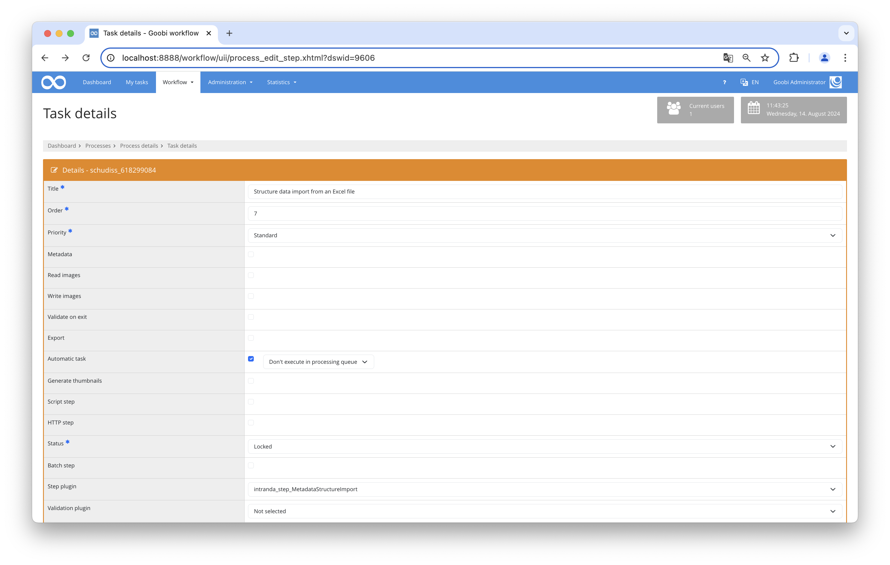

## Introduction
This is a technical documentation for the import of structure data from an Excel file.


## Installation
To install the plugin, the following file must be installed:

```bash
/opt/digiverso/goobi/plugins/step/plugin_intranda_step_MetadataStructureImport-base.jar
/opt/digiverso/goobi/plugins/config/plugin_intranda_step_MetadataStructureImport.xml
```

A new step must be added to the workflow. This step should run after the import of images and the creation of derivatives. This is an automatic step in which the `intranda_step_MetadataStructureImport` plugin must be selected.


## Overview and functionality
When the plugin is executed, it first searches for an Excel file in the configured location. The Excel file can have any name, but it must have the extension `xlsx`.

If an Excel file exists, the METS file for the process is then opened. If no pagination exists, it is created automatically.  If the file contains structural data, this is now removed. This makes it possible to call up the plugin several times with updated Excel files.

Once the preparations have been completed, the Excel file is now processed line by line. The first step is to check which hierarchy level is entered in the line. There are four options: 

- If `0`, the line is skipped, as this is the information on the publication type itself. This data has already been created by the regular import and is therefore not relevant here.
- If the hierarchy number of the current line is `the same` as that of the previous line, it is a sibling element of the last element. It is then created as the last child element of the parent element of the previous element.
- If the hierarchy number is `greater` than that of the previous line, it is a child element of the previous element. A hierarchy level is then created below the last element.
- If the hierarchy number is `lower` than that of the previous element, the previous element is searched for parent elements until one with the same number is found. The new element is then created as a sibling element of the parent element found.



## Configuration
The configuration takes place in the `plugin_intranda_step_MetadataStructureImport.xml` file:

```xml
<config_plugin>
    <!--
        order of configuration is:
          1.) project name and step name matches
          2.) step name matches and project is *
          3.) project name matches and step name is *
          4.) project name and step name are *
	-->

    <config>
        <!-- which projects to use for (can be more then one, otherwise use *) -->
        <project>*</project>
        <step>*</step>
```

The `<config>` area can be repeated as often as required and therefore allows different metadata configurations for different projects.

The sub-elements `<project>` and `<step>` are used to check whether the current block should be used for the current step. The system first checks whether there is an entry that contains both the project name and the step name. If this is not the case, the system searches for an entry for any projects marked with `*` and the step name used. If no entry is found for this either, a search is carried out for the project name and any steps, otherwise the default block is used, in which both `<project>` and `<step>` contain `*`.

```xml
        <!-- Can be an absolute path or composed with variables  -->
        <excelFolder>{processpath}</excelFolder>
        <!-- define in which row the header is written, usually 1 -->
        <rowHeader>1</rowHeader>
        <!-- define in which row the data starts, usually 2 -->
        <rowDataStart>3</rowDataStart>
        <!-- define in which row the data end -->
        <rowDataEnd></rowDataEnd>        
```

Basic things are configured here. Firstly, the location where the Excel file is to be found using `<excelFolder>`. An absolute path can be specified here or the Goobi variable System can be used.

The Excel file is then described. In `<rowHeader>` the line in which the column headers are located is defined. This is usually 1 for the first row. `<rowDataStart>` and `<rowDataEnd>` define the area in which the data to be imported is located. `<rowDataEnd>` can be used, for example, to import only a few rows as a test. If everything is to be imported, the value can simply be left blank.

```xml
        <!-- which catalogue to use -->
        <opacName>Kalliope</opacName>
        <searchField>12</searchField>
        <identifierColumnName>Kalliope-ID</identifierColumnName>
```
The optional OPAC query is configured here. `<identifierColumnName>` contains the column title in which the identifiers to be used are located. `<opacName>` and `<searchField>` must match a configured OPAC in the goobi_opac.xml file.

If these values are missing or do not point to a configured catalogue, the import takes place without an OAPC query.

```xml
        <!-- static columns -->
        <doctypeColumnName>Strukturelement_Typ</doctypeColumnName>
        <hierarchyColumnName>Ebene</hierarchyColumnName>
        <imageStartColumnName>Bild_von</imageStartColumnName>
        <imageEndColumnName>Bild_bis</imageEndColumnName>
```

Columns are then defined that have a fixed meaning. `<doctypeColumnName>` contains the name of the structure element, `<hierarchyColumnName>` contains the hierarchy number, `<imageStartColumnName>` contains the first image that is assigned to the structure element and `<imageEndColumnName>` contains the last image assigned.

```xml        
        <!-- additional metadata columns -->
        <column columnName="Haupttitel" metadata="TitleDocMain" />
        <column columnName="Kalliope-ID" metadata="CatalogIDKalliope" />
```

Any number of additional columns are now defined that are to be imported as metadata. The column heading is in `columnName` and the internal name of the metadata from the rule set is in `metadata`.

```xml
        <docstruct label="Handschrift" value="Monograph"/>
        <docstruct label="Abschnitt (Kalliope)" value="Section_Kalliope"/>
```

Finally, there is a mapping between the names for structural elements from the Excel file and the name in the rule set. The `label` attribute contains the value that is used in the configured `<doctypeColumnName>` column, while `value` contains the internal name from the rule set.

```xml
    </config>
</config_plugin>
```
